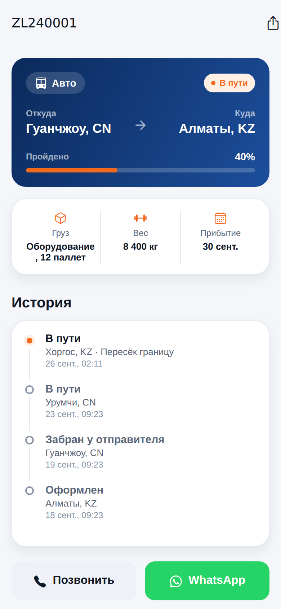
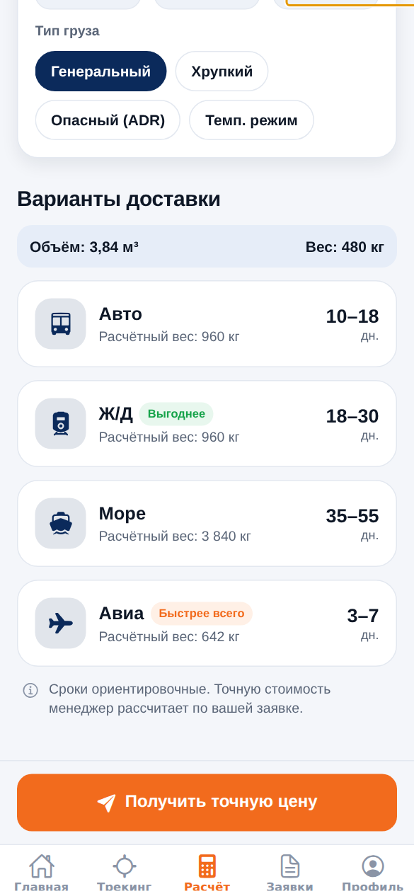
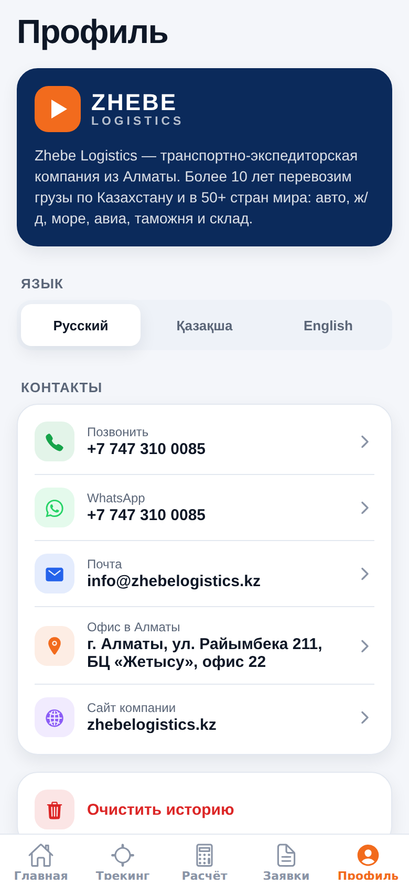
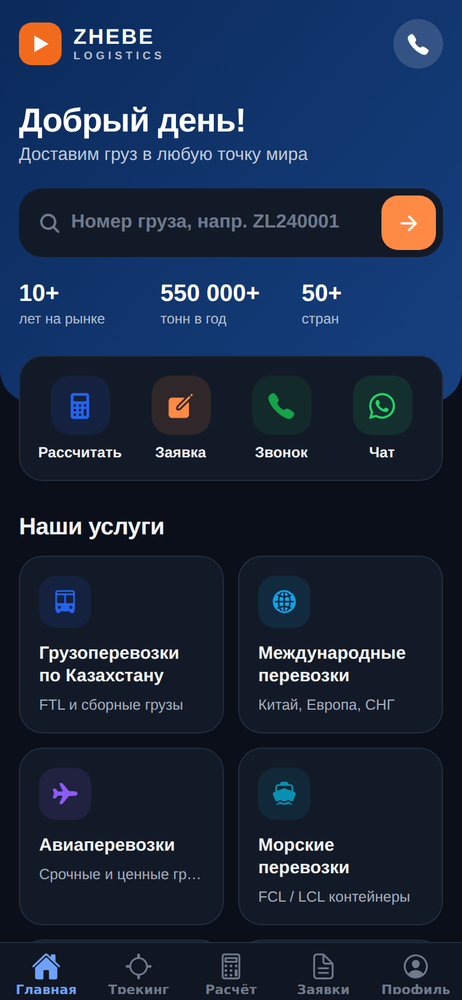

# Zhebe Logistics — мобильное приложение

Кроссплатформенное приложение (iOS + Android) для клиентов [Zhebe Logistics](https://zhebelogistics.kz), написано на **Expo (React Native) + TypeScript + Expo Router**.

| Главная | Трекинг | Расчёт | Профиль | Тёмная тема |
|---|---|---|---|---|
|  |  |  |  |  |

## Что внутри и откуда идеи

| Функция | Вдохновлено |
|---|---|
| Строка трекинга прямо на главном экране, таймлайн статусов, прогресс-бар | DHL, FedEx, СДЭК |
| Мгновенный калькулятор: сравнение Авто / Ж/Д / Море / Авиа, расчётный (объёмный) вес, бейджи «Быстрее всего» / «Выгоднее» | Freightos, Flexport |
| Градиентная «карточка-герой» и ряд быстрых действий с круглыми иконками | Kaspi.kz, Revolut |
| Крупные CTA-кнопки внизу экрана, тактильный отклик (haptics) | Yandex Go, Uber |
| Заявка в один тап — уходит в WhatsApp или на почту с заполненным текстом | Glovo, Wolt (чат с поддержкой) |
| Контакты с открытием офиса в 2ГИС | 2ГИС |
| iOS-стиль: крупные заголовки, segmented control, карточки | Apple HIG |

Также: **3 языка** (русский, қазақша, English), **тёмная тема** по системе, сохранение истории трекинга и заявок на устройстве.

## Экраны

- **Главная** — поиск груза, статистика компании, быстрые действия, активные отправки, 8 услуг, преимущества, CTA на заявку.
- **Трекинг** — поиск по номеру, недавние грузы, детальная страница с маршрутом, прогрессом и историей.
- **Расчёт** — международная / по Казахстану, вес, места, габариты, тип груза → варианты доставки со сроками.
- **Заявки** — история отправленных заявок, повтор в один тап.
- **Профиль** — язык, контакты (звонок, WhatsApp, почта, 2ГИС, сайт), о компании.
- **Услуга** — описание, что входит, кнопки «Рассчитать» и «Заказать».

## Запуск

```bash
cd app
npm install
npx expo start          # сканируйте QR-код в Expo Go на телефоне
```

Проверки: `npx tsc --noEmit` и `npx expo lint`.

Сборка для сторов — через EAS: `npx eas-cli@latest build --platform all`.

## Что нужно подключить для продакшена

1. **Реальный трекинг.** Сейчас работают демо-номера `ZL240001`, `ZL240002`, `ZL240003`. Подключите API вашей TMS/1С в `src/lib/tracking.ts` → функция `fetchShipment` (интерфейс UI менять не нужно). Для неизвестных номеров приложение предлагает запросить статус у менеджера в WhatsApp.
2. **Сроки в калькуляторе** — ориентировочные (`src/lib/calc.ts`), цены не показываются: точную стоимость считает менеджер по заявке. Поправьте сроки и коэффициенты объёмного веса под ваши тарифы.
3. **Логотип и иконка.** Сейчас нарисован временный знак-стрелка («жебе» — наконечник стрелы). Замените `assets/icon.png`, `assets/splash-icon.png` и компонент `src/components/Logo.tsx` на фирменные.
4. **Контакты** — в `src/constants/company.ts` (телефон, WhatsApp, почта, адрес).

## Структура

```
src/
  app/                 # экраны (Expo Router)
    (tabs)/            # Главная, Трекинг, Расчёт, Заявки, Профиль
    shipment/[id].tsx  # детали груза
    service/[id].tsx   # страница услуги
    request.tsx        # форма заявки (модальное окно)
  components/          # UI-кит: кнопки, карточки, таймлайн и т.д.
  constants/           # тема, услуги, контакты компании
  i18n/strings.ts      # переводы RU / KK / EN
  lib/                 # трекинг, калькулятор, звонки/WhatsApp
  store/AppStore.tsx   # язык, история (AsyncStorage)
```
